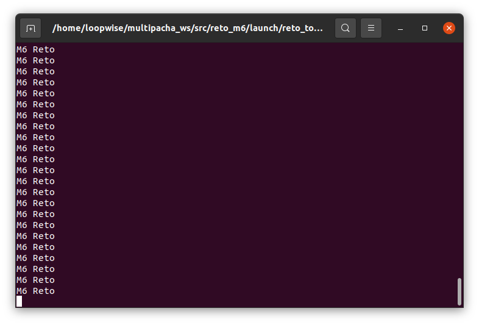
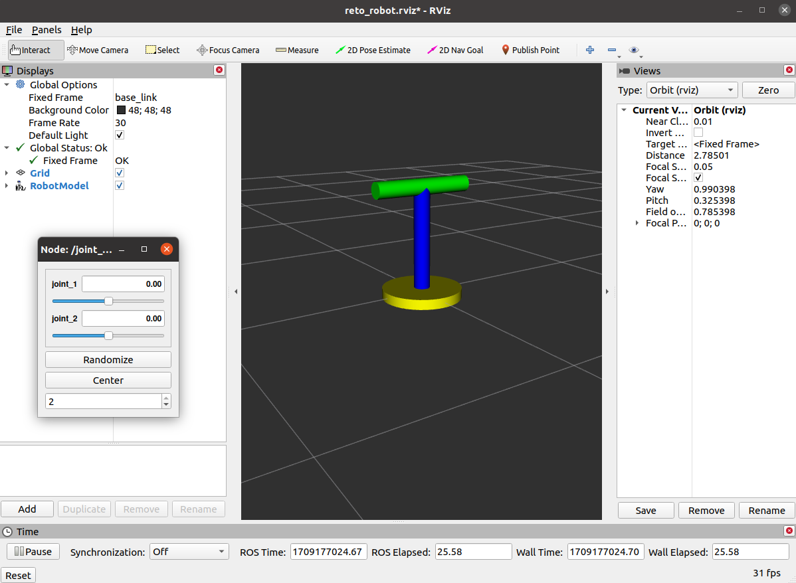
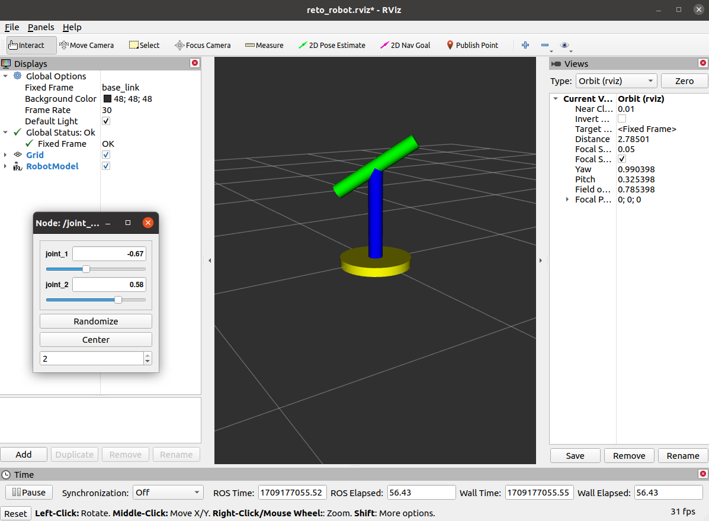
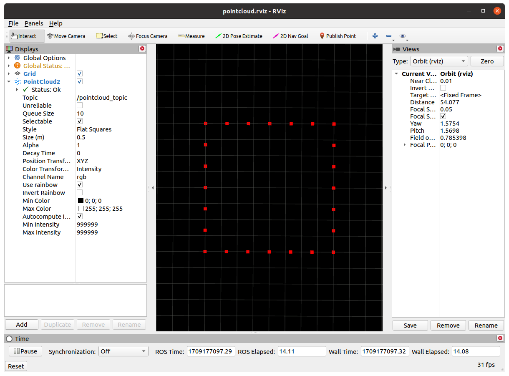
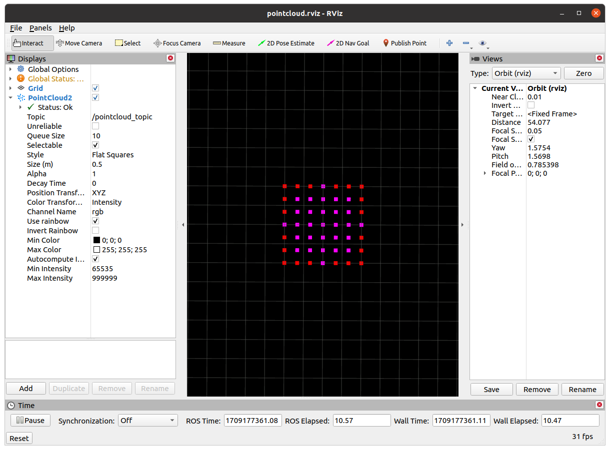
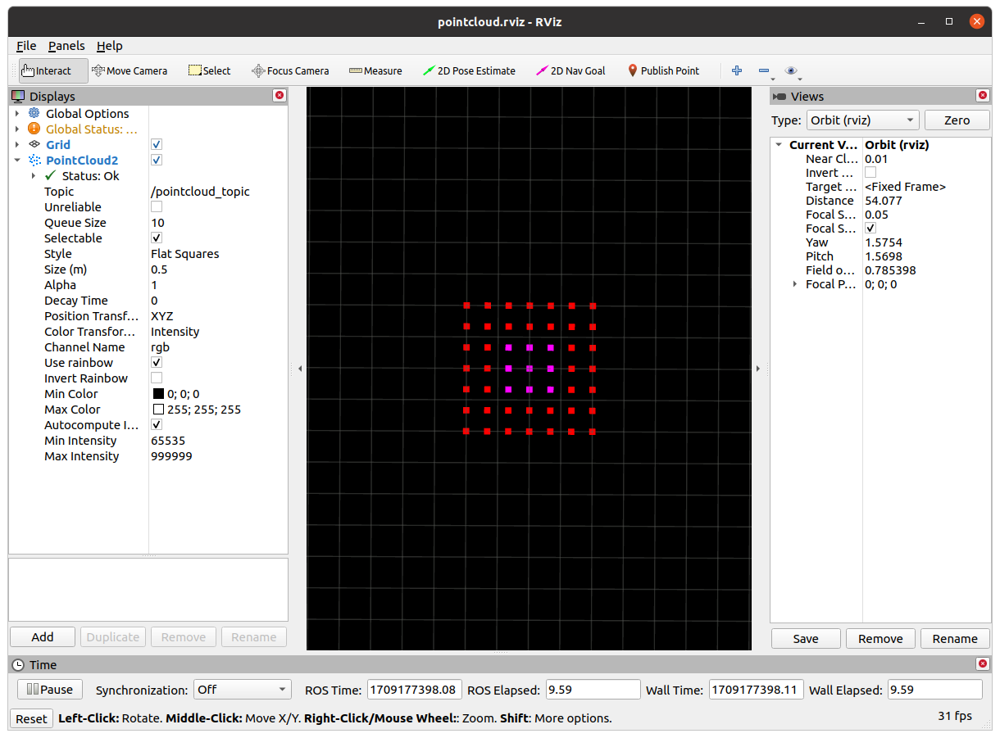
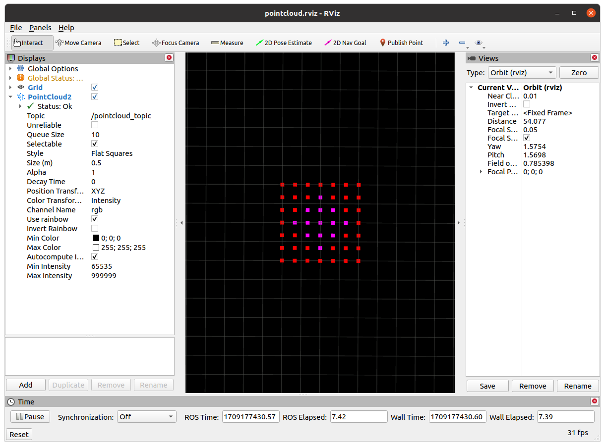

# Reto Multipacha
- Autor: Cristopher Rufasto
- Fecha: 28 - 02 - 2023
- Desarrollado en __ROS Noetic__ y __Ubuntu 20.04__.

## ¿Cómo usar?
1. Clonar el repositorio en la carpeta `src` de un workspace de ROS.
2. Compilar el workspace con `catkin_make`.
3. Ejecutar los nodos con `roslaunch reto_m6 <nombre_reto>.launch`.

Se cuenta con 4 retos en total:
- `reto_topics.launch`: Ejecuta el reto de publicación y suscripción del mensaje _M6 Reto_.
- `reto_robot.launch`: Ejecuta el reto del modelo creado en _URDF_ el cual permite emplear la _GUI_ para modificar el estado del robot.
- `reto_pointcloud.launch`: Ejecuta el reto de creación del perímetro un cuadrado y un círculo empleando el mensaje _PointCloud2_.
- `reto_filter.launch`: Ejecuta el reto de filtrado de puntos _PointCloud2_ que se encuentran dentro de un círculo.

## Reto 1: Topics
Muestra en consola el mensaje recibido por el nodo subscriptor.

```bash
roslaunch reto_m6 reto_topics.launch
```


## Reto 2: Robot URDF
Permite modificar el estado del robot mediante la interfaz gráfica.

```bash
roslaunch reto_m6 reto_robot.launch
```



## Reto 3: PointCloud
Muestra en la interfaz _Rviz_ un cuadrado y un círculo de forma iterativa (a 1 Hz) empleando el mensaje _PointCloud2_.

```bash
roslaunch reto_m6 reto_pointcloud.launch
```



## Reto 4: Filter
Muestra en la interfaz _Rviz_ los puntos que se encuentran dentro de un área circular de color morado y los que se encuentran externamente de color rojo.

```bash
roslaunch reto_m6 reto_filter.launch
```

Se muestran los resultados para los diferentes valores del radio del círculo:



